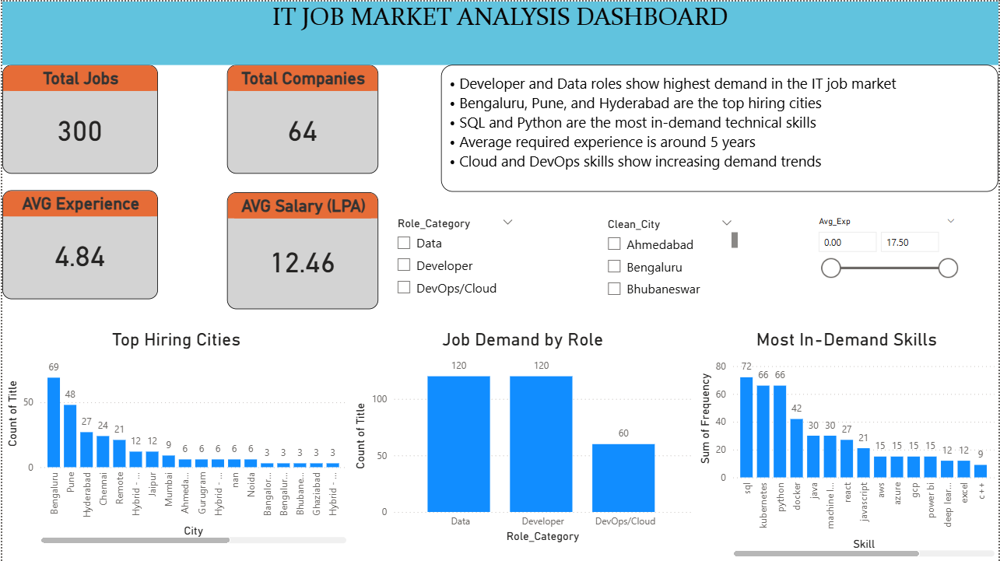

# 📊 IT Job Market Analysis & Trends Dashboard (India)

## 🚀 Project Overview

This project analyzes the **Indian IT job market** using live job data scraped from Naukri.com.
It provides insights into hiring trends, most in-demand skills, experience requirements, and top hiring cities through an interactive **Power BI dashboard**.

The project demonstrates an **end-to-end data analytics pipeline**, including:

* Web scraping
* Data cleaning & transformation
* Exploratory Data Analysis (EDA)
* Skills demand analysis (NLP-based keyword extraction)
* Business intelligence dashboard creation

---

## 🎯 Objectives

* Identify the most in-demand IT roles in India
* Analyze hiring trends across major cities
* Discover top technical skills required by employers
* Understand experience and salary distribution
* Provide actionable insights through visualization

---

## 🛠️ Tech Stack

**Programming & Data Processing**

* Python
* Pandas
* NumPy
* Regex

**Web Scraping**

* Selenium
* WebDriver Manager

**Visualization & BI**

* Power BI

**Version Control**

* Git & GitHub

---

## 📂 Project Structure

```
IT-Job-Market-Analysis
│
├── Dashboard/           # Power BI dashboard file
├── Data/                # Raw and cleaned datasets
├── Scripts/             # Python scripts for scraping & analysis
├── Images/              # Dashboard screenshot
├── EDA charts/          # Charts generated during analysis
└── README.md
```

---

## 📈 Dashboard Preview



---

## 🔍 Key Insights

* Developer and Data roles show the highest demand in the IT job market
* Bengaluru, Pune, and Hyderabad are the top hiring cities
* SQL and Python are the most in-demand technical skills
* Average required experience is approximately 5 years
* Cloud and DevOps skills show growing demand trends

---

## ⚙️ Project Workflow

1. **Data Collection**

   * Scraped job listings using Selenium from Naukri.com

2. **Data Cleaning & Transformation**

   * Extracted experience and salary ranges using regex
   * Standardized location and role categories
   * Handled missing values

3. **Exploratory Data Analysis**

   * Role demand distribution
   * City-wise hiring analysis
   * Experience & salary trends

4. **Skills Analysis**

   * Keyword-based extraction of technical skills
   * Frequency analysis to identify top skills

5. **Dashboard Development**

   * Interactive Power BI dashboard with KPIs and filters

---

## 🚀 How to Run the Project

1. Clone the repository:

```
git clone https://github.com/Patilbaliram1/IT-Job-Market-Analysis.git
```

2. Install required libraries:

```
pip install pandas selenium webdriver-manager matplotlib
```

3. Run scripts:

```
python scraper.py
python data_cleaning.py
python skills_analysis.py
```

4. Open the Power BI file from the Dashboard folder.

---

## 💡 Business Value

This project helps:

* Job seekers understand market demand
* Recruiters analyze hiring trends
* Organizations identify skill gaps
* Analysts explore employment patterns

---

## 👤 Author

**Baliram Patil**

* Aspiring Data Analyst
* Skilled in Python, SQL, Power BI, and Data Analytics

---

## ⭐ If You Like This Project

Please consider giving it a ⭐ on GitHub!

---
